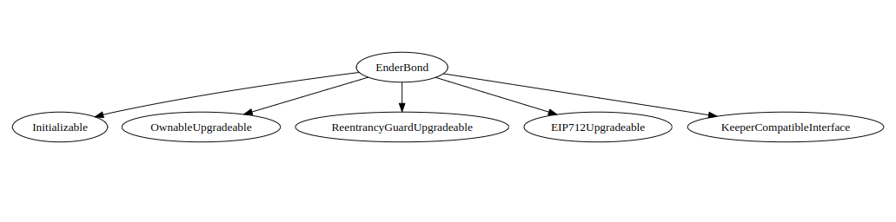

# EnderBond - Code Functionality Report

This report serves the purpose of describing the code used in `EnderBond.sol` contract in common terms while also providing some techniacal information.

## Key Features

#### 1.Bond Creation and Deposits:

Users can deposit funds into a bond by specifying the principal amount, maturity date, bond fee, and the token used for the bond.
Ether deposits are accepted by converting them into stETH through the Lido protocol.

#### 2.Withdrawal:

Users can withdraw their funds once the bond matures.
Withdrawal is only allowed after the maturity date has passed.

#### 3.Bond Fees:

The contract supports self-set bond fees, allowing users to customize the fee percentage when creating a bond.

#### 4.Interest Calculation:

The contract calculates interest based on the maturity period and a dynamically changing interest rate.

#### 5.Refraction Rewards:

Users receive refraction rewards, which are distributed based on the total bond principal and the user's share of it.

#### 6.Staking Rewards:

Users receive staking rewards, which are distributed based on the total bond principal and the user's share of it.

#### 7.Integration with External Contracts:

The contract integrates with other contracts such as the END token, Lido protocol, and various interfaces for functionalities like treasury management and staking.

#### 8.Bondable Tokens:

The contract allows the owner to specify which tokens are bondable, preventing the creation of bonds with unsupported tokens.

<!-- # Table of contents -->

<!-- <summary>Introduction, Resources, and Prerequisites</summary>
<ol>
<li><a href="#link-to-video-coming-soon">Link to video: *Coming soon...*</a></li>
<li><a href="#resources-for-this-course">Resources For This Course</a></li>
<li><a href="#prerequisites">Prerequisites</a></li>
<li><a href="#outcome">Outcome</a></li>
<li><a href="#functions">Functions</a>
  <ul>
    <li><a href="#initialize-function">initialize</a></li>
    <li><a href="#deposit-function">deposit</a></li>
  </ul>
</li>
</ol>

<summary><a href="#curriculum">Curriculum</a></summary> -->

## Dependencies and Inheritance



## State Variables

#### Mappings & Variables

Below are all the state variables and mapping keeping track of `EnderBond` state.

<details>

```javascript
   mapping(address => bool) public bondableTokens;

    /// @notice A mapping of bonds by token ID.
    mapping(uint256 => Bond) public bonds;

    mapping(uint256 => uint256) public rewardSharePerUserIndex;
    mapping(uint256 => uint256) public rewardSharePerUserIndexSend;

    mapping(uint256 => uint256) public userBondPrincipalAmount;
    mapping(uint256 => uint256) public userBondYieldShareIndex; //s0
    mapping(uint256 => uint256) public availableFundsAtMaturity;
    mapping(uint256 => uint256) public depositPrincipalAtMaturity;

    mapping(uint256 => uint256) public dayToRewardShareIndex;

    mapping(uint256 => uint256) public dayRewardShareIndexForSend;

    mapping(uint256 => uint256) public dayBondYieldShareIndex;

    // mapping(uint256 => uint256[]) public dayToBondYieldShareUpdation;
    mapping(uint256 => uint256) public secondsBondYieldShareIndex;
    ////
    mapping(uint256 => uint256[]) public dayToRefractionShareUpdation;
    mapping(uint256 => uint256) public secondsRefractionShareIndex;

    mapping(uint256 => uint256[]) public dayToRefractionShareUpdationSend;
    mapping(uint256 => uint256) public secondsRefractionShareIndexSend;

    uint256 public rewardShareIndex;
    uint256 public rewardShareIndexSend;
    uint256 public totalRewardPrincipal;
    uint256 public rateOfChange;
    uint256 public totalDeposit;
    uint256 public bondYieldShareIndex;
    uint256 public totalBondPrincipalAmount;
    uint256 public endMint;
    uint256 public bondYieldBaseRate;
    uint256 public txFees;
    uint256 public minDepositAmount;
    uint256 public SECONDS_IN_DAY;
    uint256 public lastDay;
    uint256 private amountRequired;
    uint256 private depositAmountRequired;
    uint public interval;
    uint public lastTimeStamp;

    bool public isSet;

    /// @notice An array containing all maturities.
    uint256[] public maturities;

    address private endSignature;
    address private endToken;
    address private sEndToken;
    address public lido;
    address public stEth;
    address public keeper;
    // address public endStaking;

    IBondNFT private bondNFT;
    IEnderTreasury private endTreasury;
    IEnderOracle private enderOracle;
    IEnderStaking private endStaking;

    bool public bondFeeEnabled; // status of bond-fee feature (enabled/disabled)

    struct Bond {
        bool withdrawn; // The withdrawn status of the bond
        uint256 principal; // The principal amount of the bond
        // uint256 endAmt; // The END token amount of deposit
        uint256 startTime; // Timestamp of the bond
        uint256 maturity; // The maturity date of the bond
        address token; // The token used for the bond
        uint256 bondFee; // bond fee self-set
        uint256 depositPrincipal;
        uint256 rewardPrincipal;
        uint256 refractionSIndex;
        uint256 stakingSendIndex;
        uint256 YieldIndex;
    }
```

</details>

## Methods

## initialize()

```javascript
 function initialize(address endToken_, address _lido, address _oracle) public initializer
```

Function `initialize` is the first function to be ran after contract is defloyed. Has the `initializer` check on it that ensures that it can only be ran once.

<details>
Takes 3 parameters -

-   endToken\_ - Sets address of END token
-   \_lido - Takes lido address
-   \_oracle - Takes oracle address

Updates following once ran.

1. `__Ownable_init();` - Ownable contract initializer
2. `__EIP712_init("EnderBond", "1");` - Initializes
3. `rateOfChange = 100` - NEED EXPLANING
4. `lido = _lido;` - set lido address from parameters
5. `minDepositAmount = 1000000000000000;` - 0.001 eth
6. `enderOracle = IEnderOracle(_oracle);` - set oracle address from parameters
7. `bondYieldBaseRate = 100;` set bond yield base rate to 100
8. `SECONDS_IN_DAY = 600;` - 600 is 10 mins (1 per sec)
9. `interval = 10 * 60;` - 10 mins
10. `lastTimeStamp = block.timestamp;` - current timestamp
11. `lastDay = block.timestamp / SECONDS_IN_DAY;`
12. `setBondFeeEnabled(true);` - comments say this function is not used

<details>

```javascript
  function initialize(address endToken_, address _lido, address _oracle) public initializer {
        __Ownable_init();
        __EIP712_init("EnderBond", "1");
        rateOfChange = 100;
        lido = _lido;
        setAddress(endToken_, 2);
        // todo set the value according to doc
        minDepositAmount = 1000000000000000;
        txFees = 200;
        enderOracle = IEnderOracle(_oracle);
        bondYieldBaseRate = 100;
        SECONDS_IN_DAY = 600; // note for testing purpose we have set it to 10 mint
        interval = 10 * 60; // note for testing purpose we have set it to 10 mint
        lastTimeStamp = block.timestamp;
        lastDay = block.timestamp / SECONDS_IN_DAY;

        //this function is not used
        setBondFeeEnabled(true);
    }

```

</details>
</details>

## setInterval()

```javascript
function setInterval(uint256 _interval) public onlyOwner
```

Takes \_interval as parameter and updates `interval` (uint) global >variable and emits the log.

## setBool()

```javascript
function `setBool`(bool _bool) public onlyOwner
```

Sets state of `isSet` global variable.
Is used in `claimStakingReward`, `claimRefractionRewards`, `calculateBondRewardAmount` as if (isSet) condition.

## setAddress()

```javascript
function setAddress(address _addr, uint256 _type) public onlyOwner
```

Takes `_addr` and `_type` as parameter and updates address of the token the type presents. Types are shown in full function below.

<details>

```javascript
  function setAddress(address _addr, uint256 _type) public onlyOwner {
        if (_addr == address(0)) revert ZeroAddress();

        if (_type == 1) endTreasury = IEnderTreasury(_addr);
        else if (_type == 2) endToken = _addr;
        else if (_type == 3) bondNFT = IBondNFT(_addr);
        else if (_type == 4) endSignature = _addr;
        else if (_type == 5) lido = _addr;
        else if (_type == 6) stEth = _addr;
        else if (_type == 7) keeper = _addr;
        else if (_type == 8) endStaking = IEnderStaking(_addr);

        emit AddressSet(_type, _addr);
    }

```

</details>

## setMinDepAmount

```javascript
function setMinDepAmount(uint256 _amt) public onlyOwner
```

Updates the minimum amount amount of any asset on `minDepositAmount`

## setTxFees()

```javascript
function setTxFees(uint256 _txFees) public onlyOwner
```

Updates `txFee` global variable.

## setBondYieldBaseRate()

```javascript
function setBondYieldBaseRate(uint256 _bondYieldBaseRate) public onlyOwner
```

Owner updates the `bondYieldBaseRate` global variable.

## getAddress()

```javascript
function getAddress(uint256 _type) external view returns (address addr)
```

Function returns `address` of the called `_type`

<details>

```javascript
   function getAddress(uint256 _type) external view returns (address addr) {
        if (_type == 1) addr = address(endTreasury);
        else if (_type == 2) addr = endToken;
        else if (_type == 3) addr = address(bondNFT);
        else if (_type == 4) addr = endSignature;
        else if (_type == 5) addr = lido;
    }
```

</details>

## setBondFeeEndbled

```javascript
function `setBondFeeEnabled`(bool _enabled) public onlyOwner
```

Owner swtitches whether bondFee is enabled or not. Updates `bondFeeEnabled`

## setBondableTokens()

```javascript
 function setBondableTokens(address[] calldata tokens, bool enabled) external onlyOwner
```

Owner can use multiple tokens in form of `address[]` calldata tokens and can set whetcher they are bondable or not. Updates the mapping `bondableTokens`

## getInterest()

```javascript
function getInterest(uint256 maturity) public view returns (uint256 rate)
```

Function takes `maturity` as parameter and returns `rate` that is being calculated by

rate = bondYieldBaseRate \* maturityModifier

Maturity represents `days` of the bond. Does not update state of any variable but just returns a `rate` value. The formula used is in function code below.

<details>

```javascript
     function getInterest(uint256 maturity) public view returns (uint256 rate) {
        uint256 maturityModifier;
        //Todo make it dynamic in phase 2
        unchecked {
            if (maturity >= 360) maturityModifier = 150;
            if (maturity >= 320 && maturity < 360) maturityModifier = 140;
            if (maturity >= 280 && maturity < 320) maturityModifier = 130;
            if (maturity >= 260 && maturity < 280) maturityModifier = 125;
            if (maturity >= 220 && maturity < 260) maturityModifier = 120;
            if (maturity >= 180 && maturity < 220) maturityModifier = 115;
            if (maturity >= 150 && maturity < 180) maturityModifier = 110;
            if (maturity >= 120 && maturity < 150) maturityModifier = 105;
            if (maturity >= 90 && maturity < 120) maturityModifier = 100;
            if (maturity >= 60 && maturity < 90) maturityModifier = 90;
            if (maturity >= 30 && maturity < 60) maturityModifier = 85;
            if (maturity >= 15 && maturity < 30) maturityModifier = 80;
            if (maturity >= 7 && maturity < 15) maturityModifier = 70;
            rate = bondYieldBaseRate * maturityModifier;
        }
    }
```

</details>

## deposit()

```javascript
function deposit(uint256 principal, uint256 maturity, address token, uint256 bondFee) private returns (uint256 tokenId)
```

One of the most important functions for the whole protocol. Allows `user` to create `bonds` by depositing assets (stETH, ETH) for certain amount of time. This unit of time is presented as `maturity` which defines the days of bond maturity time. It also gives you option to add a fee on top of it presented as `bondFee`.

Simple techinal breakdown below:

<details>

Takes following parameters:

-   `uint256 principal` - the principal amount of bond the user wants to deposit.
-   `uint256 maturity` - the number of days of the bond the user wants to deposit.
-   ` address token` - the address of the bond the user wants to deposit.
-   `uint256 bondFee` - the amount of bond the user wants to deposit.

and returns `tokenId`

If the following conditions are true, the transaction will be rejected (revert)

-   `principal` is lower than `minDepositAmount`
-   `maturity` is lower than 7 or is greater than 365
-   `token` is not equal to `address(0)` and the token is not bondable inside `bondableTokens` mapping.
-   `bondFee` is smaller than or equal to 0 or greater than 100.

This checks are performed first and after ensuring these the following function is ran.

```
IEndToken(endToken).distributeRefractionFees();
```

This runs the function `distributeRefractionFees` in endToken address.

<details>

```javascript
function distributeRefractionFees() external onlyRole(ENDERBOND_ROLE) {
        // if (lastEpoch + 1 days > block.timestamp) revert InvalidEarlyEpoch();
        uint256 feesToTransfer = refractionFeeTotal;
        if (feesToTransfer != 0) {
            refractionFeeTotal = 0;
            lastEpoch = block.timestamp;
            if (feesToTransfer != 0) {
                _approve(address(this), enderBond, feesToTransfer);
                IEnderBond(enderBond).epochRewardShareIndex(feesToTransfer);
                // _transfer(address(this), enderBond, feesToTransfer);
                emit RefractionFeesDistributed(enderBond, feesToTransfer);
            }
        }
    }
```

</details>

Then proceeds the actual token transfer, it is checked if the token is native or an erc20.

-   If the `token` == `address(0)` then what follows is first it makes sure if `msg.value` which is amount of native tokens (eth) is equal to the `principal` amount. Then after confirming a transfer call is made to `lido` address

```javascript
(bool suc, ) = payable(lido).call{value: msg.value}(abi.encodeWithSignature("submit()"));
```

This submit `principal` amount into Lido contract using their `submit()` method.

```javascript
function submit(address _referral) payable returns (uint256)
```

Which presumebly mints and sends stETH to `EnderBond` address from Lido address.

The submit call is made to Lido contract which takes \_referral as a parameter. Success of this .call to Lido address is awaited before proceeding. Then .transfer function is called to `stEth` address

```javascript
IERC20(stEth).transfer(address(endTreasury), IERC20(stEth).balanceOf(address(this)));
```

which transfers all the stETH balance of `EnderBond` address to `endTreasury` address and ends the flow of native token to the treasury.

-   Else other condition is if `token` is an ERC20 the `token` of `principal` amount is sent directly to `endTreasury` using

```javascript
IERC20(token).transferFrom(msg.sender, address(endTreasury), principal);
```

Thus ends the flow of deposits itself has ended yet the return of the `tokenId` from the function itself is defined by

```javascript
tokenId = _deposit(principal, maturity, token, bondFee);
```

Call to `_deposit` is made with `principal`, `maturity`, `token`, and `bondFee` as arguments which were all provided by our `depost` function itself.
Lastly

```javascript
epochBondYieldShareIndex();
// IEnderStaking(endStaking).epochStakingReward(stEth);
emit Deposit(msg.sender, tokenId, principal, maturity, token);

```

`epochBondYieldShareIndex` function is called `Deposit` event is called and the method comes to an end.

Full code:

<details>

```javascript
    function deposit(
        uint256 principal,
        uint256 maturity,
        uint256 bondFee,
        address token
    ) external payable nonReentrant returns (uint256 tokenId) {
        console.log("Deposited Amount:- ", principal);
        console.log("Maturity:- ", maturity);
        console.log("Bond Fees:- ", bondFee);
        if (principal < minDepositAmount) revert InvalidAmount();
        if (maturity < 7 || maturity > 365) revert InvalidMaturity();
        if (token != address(0) && !bondableTokens[token]) revert NotBondableToken();
        if (bondFee <= 0 || bondFee > 100) revert InvalidBondFee();
        IEndToken(endToken).distributeRefractionFees();

        // token transfer
        if (token == address(0)) {
            if (msg.value != principal) revert InvalidAmount();
            (bool suc, ) = payable(lido).call{value: msg.value}(abi.encodeWithSignature("submit()"));
            require(suc, "lido eth deposit failed");
            IERC20(stEth).transfer(address(endTreasury), IERC20(stEth).balanceOf(address(this)));
        } else {
            // send directly to the ender treasury
            IERC20(token).transferFrom(msg.sender, address(endTreasury), principal);
        }
        tokenId = _deposit(principal, maturity, token, bondFee);
        epochBondYieldShareIndex();
        // IEnderStaking(endStaking).epochStakingReward(stEth);
        emit Deposit(msg.sender, tokenId, principal, maturity, token);
    }

```

</details>

This is how intended flow of the function is according to the code.

-   Accept the basic bond details
-   Check for requirements
-   Check if `token` is whether ETH or ERC20
-   If ETH (address`(0)`)

    -   then ETH is sent to Lido
    -   inturn which mints stETH to `EnderBond` contract
    -   and transfer that stETH to `endTreasury` from `EnderBond` contract.

-   Else

    -   transfer that `token` ERC20 from `user` to `endTreasury`.

-   And finally define tokenId by calling \_deposit function.
-   epochBondYieldShareIndex() is ran and we log the `Deposit` details.

</details>

## \_deposit()

```javascript
function _deposit(uint256 principal, uint256 maturity, address token, uint256 bondFee) private returns (uint256 tokenId)
```

This method is the second component to the bond deposit. It is ran directly from `deposit()` after the token deposit is done. This function returns a (uint256 `tokenId`) and also is responsible for minting `BondNFT` to the `user`.

<details>

It starts off by making an external call to `endTreasury` on `depositTreasury`.

<br>

> EnderTreasury.sol - depositTreasury() :

<details>

```javascript
   function depositTreasury(EndRequest memory param, uint256 amountRequired) external onlyBond {
        unchecked {
            if (amountRequired > 0) {
                withdrawFromStrategy(param.stakingToken, priorityStrategy, amountRequired);
            }
            epochDeposit += param.tokenAmt;
            fundsInfo[param.stakingToken] += param.tokenAmt;
        }
    }
```

The `EndRequest memory param` gets passed in call here, which is basically a data structure of following:

```javascript
    // IEnderBase.sol code
    struct EndRequest {
        address account;
        address stakingToken; // non-zero address: stETH, zero address: ETH
        uint256 tokenAmt;
    }
```

</details>

the `depositTreasury` call is made with following parameters: `msg.sender` (EnderBond) for account, `token` as adress of the token, `principal` as as the total amount of tokens sent. These are all packed into `param` and assed on while the `amountRequired` is calculated by `getLoopCount()`.

```javascript
(EndRequest memory param, uint256 amountRequired)
```

After calling treasury external call we update the `principal` based on the fee set by the `user`.

```javascript
principal = (principal * (100 - bondFee)) / 100;
```

Next step is actually minting the BondNFT. This is done by the following code. `msg.sender` in this case will be the `user` who executed this tx all the way from `deposit`.

```javascript
tokenId = bondNFT.mint(msg.sender);
```

`.mint` will return a `uint256` which we will directly assign to `tokenId`. Which will basically be assigned as main `key` to `bonds` mapping which is again, built using assigning a `uint256` to `Bond` object.

Later some mappings and global storages are updated. `availableFundsAtMaturity` (mapping) is calculated and so is `rewardPrinciple` using `calculateRefractionData` which returns us the value for it.

```javascript
  availableFundsAtMaturity[(block.timestamp + ((maturity - 4) * SECONDS_IN_DAY)) / SECONDS_IN_DAY] += principal;
        (, uint256 rewardPrinciple) = calculateRefractionData(principal, maturity, tokenId);

        rewardSharePerUserIndex[tokenId] = rewardShareIndex;
        rewardSharePerUserIndexSend[tokenId] = rewardShareIndexSend;
        userBondYieldShareIndex[tokenId] = bondYieldShareIndex;
```

With this `rewardSharePerUserIndex`, `rewardSharePerUserIndexSend`, `userBondYieldShareIndex` mappings all assigned key of `tokenId`, are updated with current values of `rewardShareIndex`, `rewardShareIndexSend`, `bondYieldShareIndex` respectively, which are the state varibles.

Then `depositPrincipal` is calculated with the following, which makes use of `getInterest` method

```javascript
uint256 depositPrincipal = (getInterest(maturity) * ((100 + (bondFee))) * rewardPrinciple) / (365 * 100); // note we have to change 1e8 to 1e18
        depositPrincipalAtMaturity[
            (block.timestamp + ((maturity) * SECONDS_IN_DAY)) / SECONDS_IN_DAY
        ] += depositPrincipal;
```

and the following global storages are updated.

```javascript
totalDeposit += principal;
totalRewardPrincipal += depositPrincipal;
userBondPrincipalAmount[tokenId] = depositPrincipal;
totalBondPrincipalAmount += depositPrincipal;
```

Whose pepose is self explanatory by their name.

Finally `tokenId` that was generated by minting from `bondNft` contract to the user, is pushed into `bonds` mapping, which again holds info of all bonds directly connected to their tokenId.

```javascript
bonds[tokenId] = Bond(
    false,
    principal,
    block.timestamp,
    maturity,
    token,
    bondFee,
    depositPrincipal,
    rewardPrinciple,
    0, // refractionSIndex
    0, // stakingSendIndex
    0, // YieldIndex
);
```

Full code:

<details>

```javascript
function _deposit(
        uint256 principal,
        uint256 maturity,
        address token,
        uint256 bondFee
    ) private returns (uint256 tokenId) {
        endTreasury.depositTreasury(IEnderBase.EndRequest(msg.sender, token, principal), getLoopCount());
        principal = (principal * (100 - bondFee)) / 100;
        // uint256 timeNow = block.timestamp / SECONDS_IN_DAY;
        // dayToBondYieldShareUpdation[timeNow].push(block.timestamp + (maturity * SECONDS_IN_DAY));

        // mint bond nft
        tokenId = bondNFT.mint(msg.sender);
        availableFundsAtMaturity[(block.timestamp + ((maturity - 4) * SECONDS_IN_DAY)) / SECONDS_IN_DAY] += principal;

        (, uint256 rewardPrinciple) = calculateRefractionData(principal, maturity, tokenId);

        rewardSharePerUserIndex[tokenId] = rewardShareIndex;
        rewardSharePerUserIndexSend[tokenId] = rewardShareIndexSend;
        userBondYieldShareIndex[tokenId] = bondYieldShareIndex;

        uint256 depositPrincipal = (getInterest(maturity) * ((100 + (bondFee))) * rewardPrinciple) / (365 * 100); // note we have to change 1e8 to 1e18
        depositPrincipalAtMaturity[
            (block.timestamp + ((maturity) * SECONDS_IN_DAY)) / SECONDS_IN_DAY
        ] += depositPrincipal;

        totalDeposit += principal;
        totalRewardPrincipal += depositPrincipal;
        userBondPrincipalAmount[tokenId] = depositPrincipal;
        totalBondPrincipalAmount += depositPrincipal;

        // save bond info
        bonds[tokenId] = Bond(
            false,
            principal,
            block.timestamp,
            maturity,
            token,
            bondFee,
            depositPrincipal,
            rewardPrinciple,
            0,
            0,
            0
        );
    }

```

</details>

<br>
After pushing this info the function comes to an end.

This is how intended flow of the function `_deposit` is according to the code.

-   Gets triggered from inside `deposit()` and gets passed the bond details.
-   Bond info is sent into `endTreasury` using `depositTreasury`.
-   `BondNFT` is minted to `user`.
-   Updates `availableFundsAtMaturity` mapping and gets `rewardPrinciple` from `calculateRefractionData()`
-   `rewardSharePerUserIndex` , `rewardSharePerUserIndexSend` and `userBondYieldShareIndex` mappings are updated using `tokenId` as key.
-   Calculates `rewardPrinciple`.
-   Calculate `depositPrincipalAtMaturity` mapping.
-   Update the following `totalDeposit`, `totalRewardPrincipal`, `userBondPrincipalAmount`, `totalBondPrincipalAmount`.
-   Push bond details and functions ends.

</details>

## withdraw()

```javascript
function withdraw(uint256 tokenId) external nonReentrant
```

Takes `tokenId` as parameter, it doesn't hold logic for actual bond withdrawls but instead uses `_withdraw()` method to do it. Logs `Withdrawal` even after \_withdraw is finished.

## \_withdraw()

```javascript
function _withdraw(uint256 _tokenId) private
```

This method is responsible for actually processing bond withdrawals and is executed inside function `withdraw()`

<details>

Info of the bond is used from `storage` using `tokenId` key and is presented as `bond` variable.

Following checks are made -

-   if bond is not already withdrawed.
-   if caller of the tx is indeed `ownerOf` that `_tokenId` from `bondNFT` contract.
-   if bond has matured yet.

After these checks, `distributeRefractionFees()` will be called to `EndToken`.

```javascript
 // update current bond
        bond.withdrawn = true;
        endTreasury.withdraw(IEnderBase.EndRequest(msg.sender, bond.token, bond.principal), getLoopCount());
        uint256 reward = calculateBondRewardAmount(_tokenId, bond.YieldIndex);
        dayBondYieldShareIndex[bonds[_tokenId].maturity] = userBondYieldShareIndex[_tokenId];
```

Here, in code above `bond` is set as `withdrawn` status, and then `withdraw()` is call on to `endTresury`.END Rewards as `reward` is calculated using `calculateBondRewardAmount` and gets `userBondYieldShareIndex` of `_tokenId`, this statement is set by `dayBondYieldShareIndex[bonds[_tokenId].maturity]`.

Then in `EndTreasury` contract, `mintEndToUser` is called by `EnderBond` and mints END token to `msg.sender` (user in this case) for total `reward` amount of END tokens.

It is checked if `rewardShareIndex` is not equal to `rewardSharePerUserIndex` of `_tokenId`,

-   then `claimRefractionRewards()` is called using \_tokenId and its `bond`.refractionSIndex

Check again if `rewardSharePerUserIndexSend` of `_token` is not equal to `rewardShareIndexSend`.

-   `claimStakingReward` is called using \_tokenId and its `bond`.stakingSendIndex

`userBondPrincipalAmount` on \_tokenId is subtracted from `totalBondPrincipalAmount`.

<br>
Finally these global mappings and state is updated.

<details>

```javascript
userBondPrincipalAmount[_tokenId] == 0; // Bond principal amount of _tokenId
delete userBondYieldShareIndex[_tokenId]; // sets to 0

totalRewardPrincipal -= bond.depositPrincipal; //global variables are subtracted
depositAmountRequired -= bond.depositPrincipal; //global variables are subtracted
totalDeposit -= bond.principal; //global variables are subtracted
amountRequired -= bond.principal; //global variables are subtracted
```

</details>

Full code:

<details>

```javascript
    function _withdraw(uint256 _tokenId) private {
        Bond storage bond = bonds[_tokenId];
        if (bond.withdrawn) revert BondAlreadyWithdrawn();
        if (bondNFT.ownerOf(_tokenId) != msg.sender) revert NotBondUser();
        if (block.timestamp <= bond.startTime + (bond.maturity * SECONDS_IN_DAY)) revert BondNotMatured();
        // require(block.timestamp >= bond.startTime + (bond.maturity * SECONDS_IN_DAY), "Bond is not matured");
        IEndToken(endToken).distributeRefractionFees();
        // update current bond
        bond.withdrawn = true;
        endTreasury.withdraw(IEnderBase.EndRequest(msg.sender, bond.token, bond.principal), getLoopCount());
        uint256 reward = calculateBondRewardAmount(_tokenId, bond.YieldIndex);
        dayBondYieldShareIndex[bonds[_tokenId].maturity] = userBondYieldShareIndex[_tokenId];

        endTreasury.mintEndToUser(msg.sender, reward);
        if (rewardShareIndex != rewardSharePerUserIndex[_tokenId])
            claimRefractionRewards(_tokenId, bond.refractionSIndex);
        if (rewardSharePerUserIndexSend[_tokenId] != rewardShareIndexSend)
            claimStakingReward(_tokenId, bond.stakingSendIndex);
        totalBondPrincipalAmount -= userBondPrincipalAmount[_tokenId];

        userBondPrincipalAmount[_tokenId] == 0;
        delete userBondYieldShareIndex[_tokenId];

        totalRewardPrincipal -= bond.depositPrincipal;
        depositAmountRequired -= bond.depositPrincipal;
        totalDeposit -= bond.principal;
        amountRequired -= bond.principal;
    }
```

</details>
</details>

## getLoopCount()

```javascript
 function getLoopCount() public returns (uint256)
```

This function is ran in both calls made to `endTreasury`, during both `_deposit` and `_withdraw`. It returns a `uint256` called `amountRequired`.

This first calculates `currentDay` by making `block.timestamp` / `SECONDS_IN_DAY` (86400)

Full code:

<details>

```javascript
function getLoopCount() public returns (uint256) {
        // if (msg.sender != address(endTreasury)) revert NotTreasury();
        uint256 currentDay = block.timestamp / SECONDS_IN_DAY;
        if (currentDay == lastDay) return amountRequired;
        for (uint256 i = lastDay + 1; i <= currentDay; i++) {
            if (availableFundsAtMaturity[i] != 0) amountRequired += availableFundsAtMaturity[i];
            if (depositPrincipalAtMaturity[i] != 0) {
                depositAmountRequired += depositPrincipalAtMaturity[i];
            }
        }
        lastDay = currentDay;
        return amountRequired;
    }
```

</details>

## deductFeesFromTransfer()

```javascript
function deductFeesFromTransfer(uint256 _tokenId) public
```

Checks of caller is `bondNFT` address and `userBondPrincipalAmount` is not equal to 0

```javascript
userBondPrincipalAmount[_tokenId] -= (userBondPrincipalAmount[_tokenId] * txFees) / 1000000;
```

Calculates the fee to be deduced.

Full code:

<details>

```javascript
  function deductFeesFromTransfer(uint256 _tokenId) public {
        if (msg.sender != address(bondNFT)) {
            revert NotBondNFT();
        }
        if (userBondPrincipalAmount[_tokenId] == 0) {
            revert NotBondUser();
        }
        userBondPrincipalAmount[_tokenId] -= (userBondPrincipalAmount[_tokenId] * txFees) / 1000000;
    }
```

</details>

## epochRewardShareIndex()

```javascript
function epochRewardShareIndex(uint256 _reward) external
```

Checks of caller is `bondNFT` address and `userBondPrincipalAmount` is not equal to 0

```javascript
userBondPrincipalAmount[_tokenId] -= (userBondPrincipalAmount[_tokenId] * txFees) / 1000000;
```

Calculates the fee to be deduced.

Full code:

<details>

```javascript
    function epochRewardShareIndex(uint256 _reward) external {
        // if (msg.sender != keeper) revert NotKeeper();
        // if (totalRewardPrincipal == 0) revert WaitForFirstDeposit();

        if (totalDeposit != 0) {
            IERC20(endToken).transferFrom(endToken, address(this), _reward);
            uint256 timeNow = block.timestamp / SECONDS_IN_DAY;

            rewardShareIndex = (rewardShareIndex) + ((_reward * 10 ** 18) / (totalDeposit - amountRequired));
            dayToRefractionShareUpdation[timeNow].push(block.timestamp);
            dayToRewardShareIndex[timeNow] = rewardShareIndex;
        }
        emit RewardShareIndexUpdated(rewardShareIndex);
    }
```

</details>

## epochRewardShareIndex()

```javascript
function epochRewardShareIndex(uint256 _reward) external
```

Checks if `totalDeposit` is not 0 and

-   Transfers `_reward' amount of `END`tokens from`endToken`contract`EnderBond`contract.  
Gets current timestamp as`timeNow` - block.timestamp / 86400.

`rewardShareIndex` is updated by

```javascript
rewardShareIndex = rewardShareIndex + (_reward * 10 ** 18) / (totalDeposit - amountRequired);
```

Following global states update

```javascript
dayToRefractionShareUpdation[timeNow].push(block.timestamp);
dayToRewardShareIndex[timeNow] = rewardShareIndex;
```

Full code

<details>

```javascript
    function epochRewardShareIndex(uint256 _reward) external {
        // if (msg.sender != keeper) revert NotKeeper();
        // if (totalRewardPrincipal == 0) revert WaitForFirstDeposit();

        if (totalDeposit != 0) {
            IERC20(endToken).transferFrom(endToken, address(this), _reward);
            uint256 timeNow = block.timestamp / SECONDS_IN_DAY;

            rewardShareIndex = (rewardShareIndex) + ((_reward * 10 ** 18) / (totalDeposit - amountRequired));
            dayToRefractionShareUpdation[timeNow].push(block.timestamp);
            dayToRewardShareIndex[timeNow] = rewardShareIndex;
        }
        emit RewardShareIndexUpdated(rewardShareIndex);
    }

```

</details>

## epochRewardShareIndexForSend()

```javascript
function epochRewardShareIndexForSend(uint256 _reward) public
```

Takes `_reward` as parameter and updates `rewardShareIndexSend` by

```javascript
rewardShareIndexSend =
    rewardShareIndexSend + ((_reward * 10 ** 18) / totalDeposit - amountRequired);
```

Updates following storage variables:

```javascript
dayRewardShareIndexForSend[timeNow] = rewardShareIndexSend;
dayToRefractionShareUpdationSend[timeNow].push(block.timestamp);
secondsRefractionShareIndexSend[block.timestamp] = rewardShareIndexSend;
```

Full code:

<details>

```javascript
  function epochRewardShareIndexForSend(uint256 _reward) public {
        // if (msg.sender != keeper) revert NotKeeper();
        uint256 timeNow = block.timestamp / SECONDS_IN_DAY;
        rewardShareIndexSend = rewardShareIndexSend + ((_reward * 10 ** 18) / totalDeposit - amountRequired);
        dayRewardShareIndexForSend[timeNow] = rewardShareIndexSend;
        dayToRefractionShareUpdationSend[timeNow].push(block.timestamp);
        secondsRefractionShareIndexSend[block.timestamp] = rewardShareIndexSend;
    }
```

</details>

## findClosestS()

Info will be updated when this method is called.

Full code:

<details>

```javascript
   function findClosestS(uint256[] memory arr, uint256 _totalMaturity) internal pure returns (uint256 _s) {
        uint256 low = 0;
        uint256 high = arr.length - 1;
        uint256 mid;

        while (low <= high) {
            mid = (low + high) / 2;

            if (arr[mid] == _totalMaturity || (arr[mid + 1] > _totalMaturity && arr[mid] < _totalMaturity)) {
                return arr[mid];
            } else if ((arr[mid - 1] < _totalMaturity && arr[mid] > _totalMaturity)) {
                return arr[mid - 1];
            } else if (arr[mid] < _totalMaturity) {
                low = mid + 1;
            } else {
                high = mid - 1;
            }
        }

        if (arr[low] > _totalMaturity) {
            return arr[low];
        } else if (arr[high] < _totalMaturity) {
            return arr[high];
        } else {
            return 0;
        }
    }

```

</details>

## epochBondYieldShareIndex()

```javascript
function epochBondYieldShareIndex() public
```

Function gets ETH and END price from Oracle and calculates `bondYieldShareIndex`.

<details>

Function starts with getting `priceEth` and `priceEnd` from `enderOracle` and then gets current time `timeNow`.

Then `finalRewardPrincipal` is calculated by subtracting `depositAmountRequired` from `totalBondPrincipalAmount`.

```javascript
uint256 finalRewardPrincipal = (totalBondPrincipalAmount - depositAmountRequired);
```

Updates `endMint` by calculating `_endMint` by multiplying ETH price by `finalRewardPrincipal` and dividing by END price and adding it back to current `endMint`.

```javascript
uint256 _endMint = (priceEth * finalRewardPrincipal) / priceEnd;
        endMint += _endMint;
```

Followed by updating following

```javascript
  bondYieldShareIndex = bondYieldShareIndex + ((_endMint) / finalRewardPrincipal);
        dayBondYieldShareIndex[timeNow] = bondYieldShareIndex;
        secondsBondYieldShareIndex[timeNow] = bondYieldShareIndex;
        emit BondYieldShareIndexUpdated(bondYieldShareIndex);
```

<details>

```javascript
   function epochBondYieldShareIndex() public {
        // if (msg.sender != keeper) revert NotKeeper();

        (uint256 priceEth, uint256 ethDecimal) = enderOracle.getPrice(address(0));
        (uint256 priceEnd, uint256 endDecimal) = enderOracle.getPrice(address(endToken));
        uint256 timeNow = block.timestamp / SECONDS_IN_DAY;
        uint256 finalRewardPrincipal = (totalBondPrincipalAmount - depositAmountRequired);
        uint256 _endMint = (priceEth * finalRewardPrincipal) / priceEnd;
        endMint += _endMint;
        bondYieldShareIndex = bondYieldShareIndex + ((_endMint) / finalRewardPrincipal);
        dayBondYieldShareIndex[timeNow] = bondYieldShareIndex;
        secondsBondYieldShareIndex[timeNow] = bondYieldShareIndex;
        emit BondYieldShareIndexUpdated(bondYieldShareIndex);
    }
```

</details>
</details>

## calculateRefractionData()

```javascript
function calculateRefractionData(uint256 _principle,uint256 _maturity, uint256 _tokenId) internal returns (uint256 avgRefractionIndex, uint256 rewardPrinciple)
```

Calculates pending rewards for the bond. Checks if method being called by `msg.sender` is the `.ownerOf` that \_tokenId.

Average refraction index `avgRefractionIndex` is calculated by

```javascript
avgRefractionIndex = 100 + (rateOfChange * (_maturity - 1)) / (2 * 100);
```

Sets `rewardPrinciple` = (\_principle \* avgRefractionIndex) / 100. Updates `secondsRefractionShareIndex` of current `block.timestamp` to be equal to `rewardShareIndex`.

<details>

```javascript
   function calculateRefractionData(
        uint256 _principle,
        uint256 _maturity,
        uint256 _tokenId
    ) internal returns (uint256 avgRefractionIndex, uint256 rewardPrinciple) {
        if (bondNFT.ownerOf(_tokenId) != msg.sender) revert NotBondUser();
        avgRefractionIndex = 100 + ((rateOfChange * (_maturity - 1)) / (2 * 100));
        rewardPrinciple = (_principle * avgRefractionIndex) / 100;
        secondsRefractionShareIndex[block.timestamp] = rewardShareIndex;

        // pendingReward = rewardPrinciple * (rewardShareIndex - rewardSharePerUserIndex[_tokenId]);
    }

```

</details>

## calculateStakingPendingReward()

```javascript
function calculateStakingPendingReward(uint256 _principle,uint256 _maturity, uint256 _tokenId) internal returns (uint256 avgRefractionIndex, uint256 rewardPrincipleSend)
```

Calculates pending rewards for staking.Checks if method being called by `msg.sender` is the `.ownerOf` that \_tokenId. Average refraction Index of that specific token calculated by

```javascript
avgRefractionIndex = 100 + (rateOfChange * (_maturity - 1)) / (2 * 100);
```

and finally `rewardPrincipleSend` equals to `_principle` \* `avgRefractionIndex`.

Full code:

<details>

```javascript
  function calculateStakingPendingReward(
        uint _principle,
        uint256 _maturity,
        uint256 _tokenId
    ) internal view returns (uint256 avgRefractionIndex, uint256 rewardPrincipleSend) {
        if (bondNFT.ownerOf(_tokenId) != msg.sender) revert NotBondUser();
        avgRefractionIndex = 100 + ((rateOfChange * (_maturity - 1)) / (2 * 100));
        rewardPrincipleSend = _principle * avgRefractionIndex;
    }

```

</details>

## claimStakingReward()

```javascript
function claimStakingReward(uint256 _tokenId, uint256 precalUsers) public nonReentrant
```

This method claims the staking rewards over a given `_tokenId`. Unique key here being \_tokenId.

<details>
Method starts off by creating a `temp` varible of type `Bond` and assigns it the value of the specfied bond from `bonds[_tokenId]` mapping. Checks if `precalUsers` is not equal to 0 and then

-   assigns `rewardPrinciple` = `temp.principal`
-   assigins `sEndTokenReward` as

```javascript
uint sEndTokenReward = ((rewardPrinciple * (precalUsers - rewardSharePerUserIndexSend[_tokenId])) / 1e18);
```

-   This `sEndTokenReward`, if its greater than 0, then we call `.transfer` on `sEndToken` contract, and sends `sEndTokenReward` amount of `sEND` tokens to caller of the function.

Else, it checks if `ownerOf` the `_tokenId` is indeed the caller of tx and the `isSet` is set to be true.

Assigns `rewardPrinciple` = `temp.principal`

-   checks if `dayRewardShareIndexForSend` of that bonds maturity is 0
    -   sets `sEndTokenReward` to be ((`rewardPrinciple` \*
        (`rewardShareIndexSend` - `rewardSharePerUserIndexSend`[_tokenId])) / 1e18)
        -   if `sEndTokenReward` is greater than 0, sEndToken contract is called and `sEndTokenReward` amount of sEND is transferred to the `user`

```javascript
if (dayRewardShareIndexForSend[bonds[_tokenId].maturity] == 0) {
                    uint sEndTokenReward = ((rewardPrinciple *
                        (rewardShareIndexSend - rewardSharePerUserIndexSend[_tokenId])) / 1e18);

                    if (sEndTokenReward > 0) {
                        ISEndToken(sEndToken).transfer(msg.sender, sEndTokenReward);
                    }
```

-   Else it creates `sTime` and calls function `findClosestS`.
-   `userS` is created and assiged the value of `secondsRefractionShareIndexSend[sTime]`
-   `sEndTokenReward` is calculated using `userS` and `sEndToken is called for trasnfer `sEND`to user of amount`sEndTokenReward`.

```javascript
 uint256 sTime = findClosestS(
                        dayToRefractionShareUpdationSend[bonds[_tokenId].maturity],
                        ((bonds[_tokenId].maturity * SECONDS_IN_DAY) + bonds[_tokenId].startTime)
                    );
                    uint256 userS = secondsRefractionShareIndexSend[sTime];
                    uint sEndTokenReward = ((rewardPrinciple * (userS - rewardSharePerUserIndexSend[_tokenId])) / 1e18);

                    if (sEndTokenReward > 0) {
                        ISEndToken(sEndToken).transfer(msg.sender, sEndTokenReward);
                    }
```

Finally `rewardSharePerUserIndexSend` and `dayRewardShareIndexForSend` of that `_tokenId` is updated with `rewardShareIndexSend`.

Full code:

<details>

```javascript
function claimStakingReward(uint256 _tokenId, uint256 precalUsers) public nonReentrant {
        Bond memory temp = bonds[_tokenId];
        if (precalUsers != 0) {
            // (, uint rewardPrinciple) = calculateStakingPendingReward(temp.principal, temp.maturity, _tokenId);
            uint rewardPrinciple = temp.principal;
            uint sEndTokenReward = ((rewardPrinciple * (precalUsers - rewardSharePerUserIndexSend[_tokenId])) / 1e18);
            if (sEndTokenReward > 0) {
                ISEndToken(sEndToken).transfer(msg.sender, sEndTokenReward);
            }
        } else {
            if (bondNFT.ownerOf(_tokenId) != msg.sender) revert NotBondUser();
            if (isSet) {
                uint rewardPrinciple = temp.principal;
                // (, uint rewardPrinciple) = calculateStakingPendingReward(temp.principal, temp.maturity, _tokenId);

                if (dayRewardShareIndexForSend[bonds[_tokenId].maturity] == 0) {
                    uint sEndTokenReward = ((rewardPrinciple *
                        (rewardShareIndexSend - rewardSharePerUserIndexSend[_tokenId])) / 1e18);

                    if (sEndTokenReward > 0) {
                        ISEndToken(sEndToken).transfer(msg.sender, sEndTokenReward);
                    }
                } else {
                    uint256 sTime = findClosestS(
                        dayToRefractionShareUpdationSend[bonds[_tokenId].maturity],
                        ((bonds[_tokenId].maturity * SECONDS_IN_DAY) + bonds[_tokenId].startTime)
                    );
                    uint256 userS = secondsRefractionShareIndexSend[sTime];
                    uint sEndTokenReward = ((rewardPrinciple * (userS - rewardSharePerUserIndexSend[_tokenId])) / 1e18);

                    if (sEndTokenReward > 0) {
                        ISEndToken(sEndToken).transfer(msg.sender, sEndTokenReward);
                    }
                }
                rewardSharePerUserIndexSend[_tokenId] = rewardShareIndexSend;
                dayRewardShareIndexForSend[_tokenId] = rewardShareIndexSend;
            } else {
                revert NotAllowed();
            }
        }
    }
```

</details>
</details>

## clainRefractionRewards()

This method claims the refraction rewards for bonds over a given `_tokenId`. Unique key here being \_tokenId.

<details>
Method starts off by creating a `temp` varible of type `Bond` and assigns it the value of the specfied bond from `bonds[_tokenId]` mapping. Checks if `precalUsers` is not equal to 0 and then

-   assigns `rewardPrinciple` = `temp.principal`

-   Then we call `.transfer` on `EndToken` contract, and sends `((rewardPrinciple * (precalUsers - rewardSharePerUserIndex[_tokenId])) / 1e18)` amount of `END` tokens to caller of the function.

```javascript
 if (precalUsers != 0) {
            uint rewardPrinciple = temp.principal;
            // (, uint rewardPrinciple) = calculateRefractionData(temp.principal, temp.maturity, _tokenId);
            IERC20(endToken).transfer(
                msg.sender,
                ((rewardPrinciple * (precalUsers - rewardSharePerUserIndex[_tokenId])) / 1e18)
            );
```

Else, it checks if `isSet` is set to be true and makes few checks on that `tokenId`

-   Makes sure caller of tx is the owner of that `bondNFT`
-   Makes sure `userBondPrincipalAmount` of that token is not 0
-   Makes sure `rewardShareIndex` is not equal to `rewardSharePerUserIndex[_tokenId]`

Assigns `rewardPrinciple` = `temp.principal`

```javascript
   if (isSet) {
                if (bondNFT.ownerOf(_tokenId) != msg.sender) revert NotBondUser();
                if (userBondPrincipalAmount[_tokenId] == 0) revert NotBondUser();
                if (rewardShareIndex == rewardSharePerUserIndex[_tokenId]) revert NoRewardCollected();
                uint rewardPrinciple = temp.principal;
```

-   checks if `dayRewardShareIndexForSend` of that bonds maturity is 0
    -   Calls `EndToken` contract to call `.transfer` and sends the `user` `((rewardPrinciple * (rewardShareIndex - rewardSharePerUserIndex[_tokenId])) / 1e18)` amount of `END` tokens.

```javascript
if (dayToRewardShareIndex[bonds[_tokenId].maturity] == 0) {
                    IERC20(endToken).transfer(
                        msg.sender,
                        ((rewardPrinciple * (rewardShareIndex - rewardSharePerUserIndex[_tokenId])) / 1e18)
                    );
```

-   Else it creates `sTime` and calls function `findClosestS`.
-   `userS` is created and assiged the value of `secondsRefractionShareIndex[sTime]`
-   `EndToken is called for trasnfer `END`to user of amount`((rewardPrinciple \* (userS - rewardSharePerUserIndex[_tokenId])) / 1e18)`

```javascript
 uint256 sTime = findClosestS(
                        dayToRefractionShareUpdation[bonds[_tokenId].maturity],
                        ((bonds[_tokenId].maturity * SECONDS_IN_DAY) + bonds[_tokenId].startTime)
                    );
                    uint256 userS = secondsRefractionShareIndex[sTime];
                    IERC20(endToken).transfer(
                        msg.sender,
                        ((rewardPrinciple * (userS - rewardSharePerUserIndex[_tokenId])) / 1e18)
                    );
```

Finally `rewardSharePerUserIndex` and `dayToRewardShareIndex` of that `_tokenId` is updated with `rewardShareIndexSend`.

Full code:

<details>

```javascript
function claimRefractionRewards(uint256 _tokenId, uint256 precalUsers) public nonReentrant {
        Bond memory temp = bonds[_tokenId];
        if (precalUsers != 0) {
            uint rewardPrinciple = temp.principal;
            // (, uint rewardPrinciple) = calculateRefractionData(temp.principal, temp.maturity, _tokenId);
            IERC20(endToken).transfer(
                msg.sender,
                ((rewardPrinciple * (precalUsers - rewardSharePerUserIndex[_tokenId])) / 1e18)
            );
        } else {
            if (isSet) {
                if (bondNFT.ownerOf(_tokenId) != msg.sender) revert NotBondUser();
                if (userBondPrincipalAmount[_tokenId] == 0) revert NotBondUser();
                if (rewardShareIndex == rewardSharePerUserIndex[_tokenId]) revert NoRewardCollected();
                uint rewardPrinciple = temp.principal;
                // (, uint rewardPrinciple) = calculateRefractionData(temp.principal, temp.maturity, _tokenId);
                if (dayToRewardShareIndex[bonds[_tokenId].maturity] == 0) {
                    IERC20(endToken).transfer(
                        msg.sender,
                        ((rewardPrinciple * (rewardShareIndex - rewardSharePerUserIndex[_tokenId])) / 1e18)
                    );
                } else {
                    uint256 sTime = findClosestS(
                        dayToRefractionShareUpdation[bonds[_tokenId].maturity],
                        ((bonds[_tokenId].maturity * SECONDS_IN_DAY) + bonds[_tokenId].startTime)
                    );
                    uint256 userS = secondsRefractionShareIndex[sTime];
                    IERC20(endToken).transfer(
                        msg.sender,
                        ((rewardPrinciple * (userS - rewardSharePerUserIndex[_tokenId])) / 1e18)
                    );
                }

                rewardSharePerUserIndex[_tokenId] = rewardShareIndex;
                dayToRewardShareIndex[bonds[_tokenId].maturity] = rewardShareIndex;
            } else {
                revert NotAllowed();
            }
        }
    }
```

</details>
</details>

## calculateBondRewardAmount()

```javascript
function calculateBondRewardAmount(uint256 _tokenId, uint256 precalUsers) internal view returns (uint256 _reward)
```

Calculates Bond rewards of a given `_tokenId`. Returns a `uint256` called `_reward`. This method is called inside the `_withdraw` method.

<details>

Checks if `precalUsers` is not equal to 0, then sets `_reward` by

```javascript
_reward = userBondPrincipalAmount[_tokenId] * (precalUsers - userBondYieldShareIndex[_tokenId]);
```

Else, confirms if `isSet` is active:

-   if `(dayBondYieldShareIndex[bonds[_tokenId].maturity] == 0)` sets the `\_reward' by

```javascript
_reward =
    userBondPrincipalAmount[_tokenId] * (bondYieldShareIndex - userBondYieldShareIndex[_tokenId]);
```

-   else calculates `userS` using following formula:

```javascript
        uint256 userS = secondsBondYieldShareIndex[
           ((bonds[_tokenId].maturity * SECONDS_IN_DAY) + bonds[_tokenId].startTime)
                    ] == 0
                        ? secondsBondYieldShareIndex[
                            ((bonds[_tokenId].maturity * SECONDS_IN_DAY) + bonds[_tokenId].startTime) - 1
                        ]
                        : secondsBondYieldShareIndex[
                            ((bonds[_tokenId].maturity * SECONDS_IN_DAY) + bonds[_tokenId].startTime)
                        ];
                    _reward = (userBondPrincipalAmount[_tokenId] * (userS - userBondYieldShareIndex[_tokenId]));
                }
```

Full code:

```javascript
    function calculateBondRewardAmount(uint256 _tokenId, uint256 precalUsers) internal view returns (uint256 _reward) {
        if (precalUsers != 0) {
            _reward = (userBondPrincipalAmount[_tokenId] * (precalUsers - userBondYieldShareIndex[_tokenId]));
        } else {
            if (isSet) {
                if (dayBondYieldShareIndex[bonds[_tokenId].maturity] == 0) {
                    _reward = (userBondPrincipalAmount[_tokenId] *
                        (bondYieldShareIndex - userBondYieldShareIndex[_tokenId]));
                } else {
                    uint256 userS = secondsBondYieldShareIndex[
                        ((bonds[_tokenId].maturity * SECONDS_IN_DAY) + bonds[_tokenId].startTime)
                    ] == 0
                        ? secondsBondYieldShareIndex[
                            ((bonds[_tokenId].maturity * SECONDS_IN_DAY) + bonds[_tokenId].startTime) - 1
                        ]
                        : secondsBondYieldShareIndex[
                            ((bonds[_tokenId].maturity * SECONDS_IN_DAY) + bonds[_tokenId].startTime)
                        ];
                    _reward = (userBondPrincipalAmount[_tokenId] * (userS - userBondYieldShareIndex[_tokenId]));
                }
            } else {
                revert NotAllowed();
            }
        }
    }
```

</details>

## checkUpkeep()

```javascript
function checkUpkeep(bytes calldata) external view override returns (bool upkeepNeeded, bytes memory performData)
```

Function returns `upkeepNeeded` as a boolean

```javascript
upkeepNeeded = block.timestamp - lastTimeStamp > interval;
```

## performUpkeep()

```javascript
function performUpkeep(bytes calldata /* performData */) external override
```

Function checks if `((block.timestamp - lastTimeStamp) > interval)` then sets `lastTimeStamp` as current `block.timestamp` and calls `epochBondYieldShareIndex()`.

Lastly makes external call `epochStakingReward(stEth)` in `endStaking` contract.

Full code:

<details>

```javascript
   function performUpkeep(bytes calldata /* performData */) external override {
        //We highly recommend revalidating the upkeep in the performUpkeep function
        if ((block.timestamp - lastTimeStamp) > interval) {
            lastTimeStamp = block.timestamp;
            epochBondYieldShareIndex();
            endStaking.epochStakingReward(stEth);
        }
        // We don't use the performData in this example. The performData is generated by the Keeper's call to your checkUpkeep function
    }
```

</details>

## setIndexesOfUser()

```javascript
function setIndexesOfUser(uint256 tokenId, uint256 refractionSIndex, uint256 stakingSendIndex, uint256 YieldIndex) external onlyOwner
```

Method is only called by `owner`, updates the `bonds` mappings properties of that certain `tokenId`.

```javascript
bonds[tokenId].refractionSIndex = refractionSIndex;
bonds[tokenId].stakingSendIndex = stakingSendIndex;
bonds[tokenId].YieldIndex = YieldIndex;
```

Full code:

<details>

```javascript
  function setIndexesOfUser(
        uint256 tokenId,
        uint256 refractionSIndex,
        uint256 stakingSendIndex,
        uint256 YieldIndex
    ) external onlyOwner {
        bonds[tokenId].refractionSIndex = refractionSIndex;
        bonds[tokenId].stakingSendIndex = stakingSendIndex;
        bonds[tokenId].YieldIndex = YieldIndex;
        emit RewardSharePerUserIndexSet(tokenId, rewardShareIndex);
    }
```

</details>

## resetEndMint()

```javascript
function resetEndMint() external
```

Checks if the method is only being called by `endTreasury` and resets `endMint` variable to 0.

Full code:

<details>

```javascript
  function resetEndMint() external {
        require(msg.sender == address(endTreasury));
        endMint = 0;
    }
```

</details>

## receive()

```javascript
receive() external payable {}
```

Allows smart contract to receive `msg.value`.
